# CUSTOMER — Book a Service

**Actor(s):** CUSTOMER  
**Goal:** Submit a booking request on a tenant's hotsite as an authenticated customer  
**UCs covered:** UC-021, UC-002, UC-011  
**Status:** Draft

## Flow

```mermaid
flowchart TD
    classDef existing fill:#e6ffe6,stroke:#3a3
    classDef gap stroke:#f00,stroke-dasharray: 5 5,fill:#fee

    Start(["Hotsite /{slug}"]) --> LoginCTA(("Click 'Entrar'"))
    LoginCTA --> LoginPage["❓ GAP: /auth/login<br/>UC-021 — M13-S02"]
    LoginPage --> OAuth(("Google OAuth"))
    OAuth --> Callback["❓ GAP: /api/auth/callback/google<br/>Sets httpOnly JWT cookie"]
    Callback --> Tenants{"1 tenant?"}
    Tenants -- yes --> Hotsite["/{slug}"]
    Tenants -- no --> SelectTenant["❓ GAP: /select-tenant<br/>UC-021 A3 — M13-S02"]
    SelectTenant --> Hotsite

    Hotsite --> CTA(("Click 'Agendar'"))
    CTA --> S1["/[slug]/booking<br/>Step 1: Select Services"]

    S1 --> Pickup{"requiresPickupAddress?"}
    Pickup -- yes --> PickupField["AddressFields — pickup (pre-filled from defaultAddress)"]
    Pickup -- no --> S2
    PickupField --> S2

    S2["/[slug]/booking<br/>Step 2: Calendar |UC-011|"] --> DayClick(("Click green day"))
    DayClick --> SlotPicker["SlotPicker"]
    SlotPicker --> S3

    S3["❓ GAP: /[slug]/booking<br/>Step 3: Review + Address<br/>No personal info form — pre-filled from JWT<br/>M13-S02 or new story"] --> S4

    S4["/[slug]/booking<br/>Step 4: Confirm & Submit"]
    S4 --> Submit(("Confirmar agendamento"))
    Submit --> POST["POST /bookings/authenticated<br/>Auth: JWT cookie → X-Actor-* headers"]
    POST --> SlotOk{"HTTP status?"}
    SlotOk -- 201 Created --> Done["'Solicitação enviada!<br/>Aguarde confirmação por email'"]
    SlotOk -- 409 Conflict --> S2Error["'Horário indisponível'<br/>→ back to step 2"]

    class S1,PickupField,S2,DayClick,SlotPicker,S4,Submit,POST,Done,S2Error existing
    class LoginPage,Callback,SelectTenant,Hotsite,CTA,S3 gap
```

## Pages referenced

| Page / Route | Component | Story | Status |
|---|---|---|---|
| `/auth/login` | New page | M13-S02 | ❌ Gap |
| `/api/auth/callback/google` | Next.js route handler | M13-S02 | ❌ Gap |
| `/select-tenant` | New page (multi-tenant picker) | M13-S02 | ❌ Gap |
| `/[slug]/booking` Step 1 | `ServiceSelectionStep` (reuse, no changes) | M12-S07 | ✅ Existing |
| `/[slug]/booking` Step 2 | `AvailabilityCarousel` + `SlotPicker` (reuse) | M12-S07 | ✅ Existing |
| `/[slug]/booking` Step 3 | `AuthenticatedBookingReviewStep` (new) | M13-S02 or new story | ❌ Gap |
| `/[slug]/booking` Step 4 | `ConfirmationStep` (reuse, no changes) | M12-S07 | ✅ Existing |

## Open questions / gaps

- [ ] **UC-021 frontend** (login + OAuth callback + tenant selection) — M13-S02. This entire journey becomes reachable only after M13-S02 ships. Steps 1–2–4 are already built; they just can't be reached by an authenticated customer yet.
- [ ] **Step 3 `AuthenticatedBookingReviewStep`** — no story exists. Needs: pickup address pre-filled from `customer.defaultAddress`; optional `PhotoUpload`; omit name/email/phone form entirely. Propose adding to M13-S02 or as a new story.
- [ ] **`BookingForm` branching** — needs a `mode: 'guest' | 'customer'` prop (or a sibling `AuthenticatedBookingForm`) to branch step 3 and call `POST /bookings/authenticated` vs `POST /bookings`. `page.tsx` detects auth from JWT cookie and passes the right mode.
- [ ] **Customer `defaultAddress` source** — Option A: include in JWT payload; Option B: `GET /customers/me` on step 3 mount. Recommend Option B — keeps JWT lean. BFF endpoint `GET /customers/me` may not yet exist.
