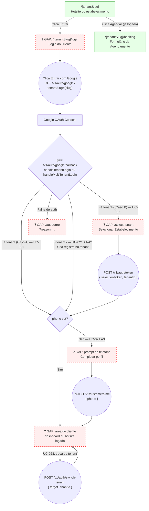

# CUSTOMER — Login (UC-021 + UC-023)

**Actor(s):** CUSTOMER  
**Goal:** Customer authenticates with Google OAuth from a tenant's hotsite and lands on the customer area; customers belonging to multiple tenants can select which tenant to enter  
**UCs covered:** UC-021, UC-023  
**Status:** Draft

## Flow

## Pages referenced

| Page / Route | Component | Story | Status |
|---|---|---|---|
| `/{tenantSlug}` | hotsite pages | M12 | ✅ Existente |
| `/{tenantSlug}/booking` | `BookingForm` | M12-S07 | ✅ Existente |
| `/{tenantSlug}/login` | `CustomerLoginPage` | M124-S02 | ❌ GAP |
| `/select-tenant` | `SelectTenantPage` | M124-S02 | ❌ GAP |
| profile completion prompt | inline on first-visit page | M124-S02 | ❌ GAP |
| `/auth/error` | `AuthErrorPage` | M124-S01 | ❌ GAP (shared with staff) |
| customer area / dashboard | TBD | future | ❌ GAP |

## BFF calls in this flow

| Call | When |
|---|---|
| `GET /v1/auth/google?tenantSlug={slug}` | Customer clicks "Entrar" from hotsite |
| `GET /v1/auth/google` (no slug) | Generic entry — triggers multi-tenant lookup |
| `GET /internal/customers/tenants?googleOAuthId=...` | BFF callback — Case B multi-tenant check |
| `POST /internal/customers` | BFF callback — find or create customer for tenant |
| `POST /v1/auth/token { selectionToken, tenantId }` | Frontend after tenant selection (Case B) |
| `PATCH /v1/customers/me { phone }` | UC-021 A3 — phone collection |
| `POST /v1/auth/switch-tenant { targetTenantId }` | UC-023 — switch active tenant |

## Open questions / gaps

- [ ] **Customer area after login:** where does the customer land after successful login? Hotsite with session context (logged-in hotsite)? A dedicated `/minha-conta` page? This determines whether the customer dashboard is part of M124 or a separate milestone.
- [ ] **Phone completion placement (UC-021 A3):** is this a separate page or an inline modal/banner on the first screen after login? Prototype shows it as an inline prompt; decide before M124-S02.
- [ ] **`/auth/error` shared route:** staff and customer auth failures both redirect to `/auth/error?reason=...`. Should this be one shared page (`apps/web/app/auth/error/page.tsx`) or separate per actor? Shared is simpler — one page, content driven by `?reason`.
- [ ] **UC-023 trigger:** the "Switch Tenant" action lives somewhere in the customer area after login. Which component holds it — topbar avatar dropdown? `/minha-conta` page? Decide when the customer area journey is designed.
- [ ] **Generic login entry (no tenantSlug):** `/auth/login` (no slug) is the multi-tenant fallback. Is there a branded entry point for this, or is it only reachable via the BFF when `handleMultiTenantLogin` redirects to `/select-tenant?token=...`? The prototype only covers the hotsite-entry (tenant-scoped) path.

## Prototype

Folder: `customer/prototypes/login/`

| File | Screen | UC | Story | Status |
|---|---|---|---|---|
| `index.html` | Navigation hub | — | — | ✅ Criado |
| `00-hotsite.html` | Hotsite entry (redirect → shared/hotsite.html) | — | — | ✅ Criado |
| `00-login.html` | Customer login screen (redirect → shared/login.html) | UC-021 | M124-S02 | ✅ Criado |
| `01-select-tenant.html` | Selecionar estabelecimento (Case B — +1 tenants) | UC-021 Caso B | M124-S02 | ✅ Criado |
| `02-phone-completion.html` | Completar perfil — solicita telefone | UC-021 A3 | M124-S02 | ✅ Criado |
| `01b-error.html` | Auth error (no-tenant, email-mismatch, tenant-deactivated) | UC-021 A1 err | M124-S01 | ✅ Criado |
| `dev-notes.md` | Implementation handoff | — | M124 | ✅ Criado |
