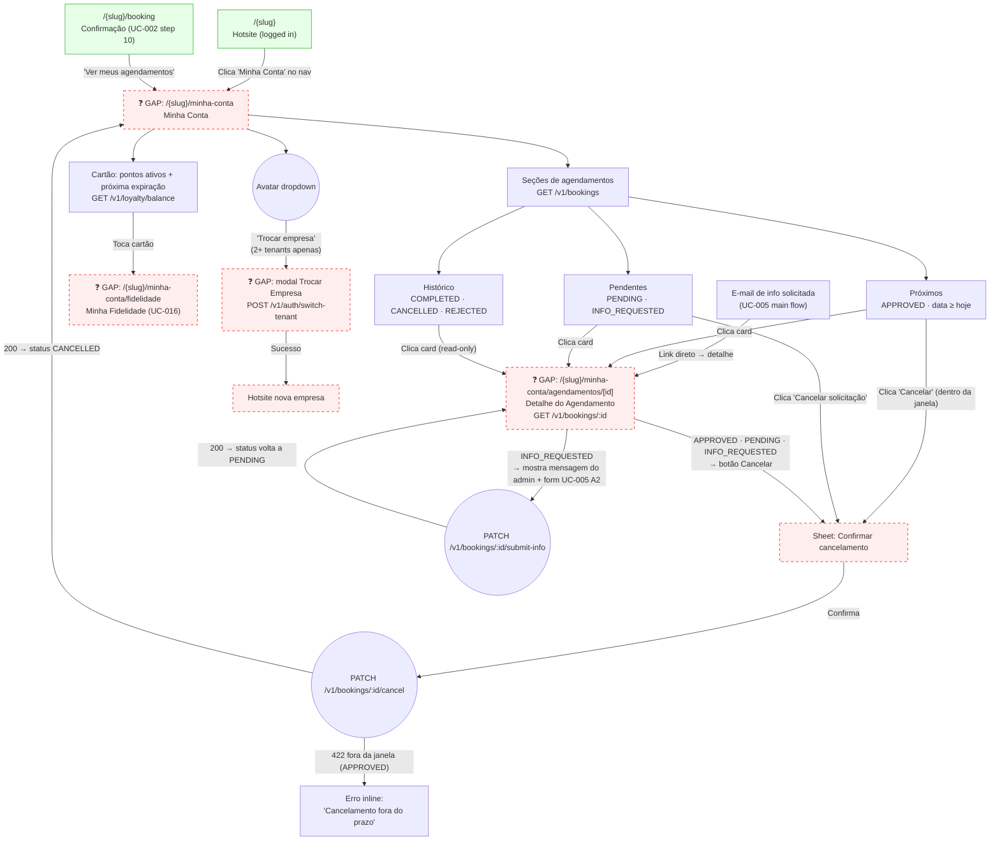

# CUSTOMER — Minha Conta (UC-006 + UC-007 + UC-016 summary)

**Actor(s):** CUSTOMER  
**Goal:** Logged-in customer views their booking history, checks loyalty balance, and cancels eligible bookings — all scoped to the current tenant  
**UCs covered:** UC-006, UC-007, UC-016 (balance summary + full breakdown), UC-023 (trigger), UC-005 A2 (authenticated customer path)  
**Status:** Draft

## Flow

## Pages referenced

| Page / Route | Component | Story | Status |
|---|---|---|---|
| `/{slug}` (hotsite, logged-in nav) | `HotsiteLayout` logged-in state | M12 | ✅ Existente |
| `/{slug}/booking` (post-booking CTA) | `BookingForm` / confirmation | M12-S07 | ✅ Existente |
| `/{slug}/minha-conta` | `MinhaContaPage` | M13-S27 | ❌ GAP |
| `/{slug}/minha-conta/agendamentos/[id]` | `AgendamentoDetailPage` | M13-S28 | ❌ GAP |
| Cancel sheet | inline `CancelSheet` component on both pages | M13-S28 | ❌ GAP |
| Info submit form (UC-005 A2) | inline section on detail page (customer auth path) | M13-S28 | ❌ GAP |
| `/{slug}/minha-conta/fidelidade` | `MinhaFidelidadePage` | M13-S29 | ❌ GAP |
| Tenant switch modal/page (UC-023) | `TrocarEmpresaPage` — avatar dropdown trigger | M13-S30 | ❌ GAP |

## BFF calls in this flow

| Call | When | Roles |
|---|---|---|
| `GET /v1/bookings` | Minha-conta page load — full booking list | CUSTOMER (filtered to own bookings) |
| `GET /v1/loyalty/balance` | Minha-conta page load — points card | CUSTOMER |
| `GET /v1/loyalty/entries` | Fidelidade page — earning history (paginated) | CUSTOMER |
| `GET /v1/loyalty/redemptions` | Fidelidade page — redemption history (paginated) | CUSTOMER |
| `POST /v1/auth/switch-tenant { targetTenantId }` | UC-023 — customer selects new tenant | CUSTOMER |
| `GET /v1/bookings/:id` | Detail page load | CUSTOMER (ownership enforced) |
| `PATCH /v1/bookings/:id/cancel` | Customer confirms cancel — BFF routes to `/cancel-customer` | CUSTOMER |
| `PATCH /v1/bookings/:id/submit-info` | Customer submits info on INFO_REQUESTED booking (UC-005 A2) | CUSTOMER |

## Section logic (UC-006 step 1)

| Section | Statuses shown | Date filter | Action |
|---|---|---|---|
| **Próximos** | APPROVED | `scheduledAt ≥ today` | Cancel button (if within window) |
| **Pendentes** | PENDING, INFO_REQUESTED | any | "Cancelar solicitação" always shown |
| **Histórico** | COMPLETED, CANCELLED, REJECTED | any | Read-only; no action |

Cancel button visibility for **Próximos** (APPROVED): hidden with note when `scheduledAt − now() < tenants.settings.booking.cancellation_window_hours` (UC-006 A2).

## Open questions / gaps

- [ ] **"Total washes completed" + "Most recently completed service" (UC-006 step 6):** `GET /v1/loyalty/balance` returns only `{ currentPoints, nextExpiryDate, nextExpiryPoints }`. Neither "total washes" nor "last service" is available from this endpoint. Options: (a) add fields to balance endpoint, (b) derive from `GET /v1/loyalty/entries` pagination `total` + first entry's `serviceName`, (c) drop from MVP minha-conta. Decide before `M13-S27` starts.
- [ ] **`CustomerBookingListResponse` DTO missing from `packages/types/src/`:** only a backend-internal `BookingListItem` exists. Add to `packages/types/` in `M13-S27`.
- [ ] **UC-005 A2 scope:** should the info submission form live in this journey's detail page or a separate journey? Recommendation: include it inline in `M13-S28` (detail page) since the customer reaches it from "My Bookings" — it's not a separate navigation destination.
- [x] **Post-cancel destination:** after successful cancel from the detail page, navigate back to `/{slug}/minha-conta` list (recommended) or show inline CANCELLED state on the detail page and let the customer navigate back manually? — **Resolved.** Redirects to the minha-conta list, implemented in `M13-S28`.
- [ ] **Empty state CTA (UC-006 A1):** when customer has no bookings, what does the CTA say? "Fazer um agendamento" → `/{slug}/booking`?
- [ ] **`GET /v1/bookings` query params for customer:** the existing endpoint accepts `status` filter. Should the frontend call it once (all statuses) and split client-side, or call it three times (one per section)? Single call + client split is simpler.
- [x] **Pagination:** UC-006 doesn't specify pagination behaviour. The backend supports `limit`/`offset`. — **Resolved.** `limit=50`, no infinite scroll, implemented in `M13-S27`.
- [ ] **Loyalty conversion-rate display (`04-fidelidade.html` balance card):** the prototype shows a points→currency conversion rate ("10 pts = R$ 1,00 · Valor total: R$ 12,00"), gated on `points_per_currency_unit > 0`. Per CLAUDE.md §3, the Loyalty MVP is **points-balance only** — no currency-conversion display is part of the documented MVP scope. The BFF-side dependency (`conversionRate` field on the loyalty balance response) has already been built and resolved by `M13-S12` — this is now purely a UX/product-scope question (does the documented MVP want this UI element at all), not a data-availability question. Verify against UC-016's actual MVP scope before implementation; this UI element may need to be cut or deferred to a post-MVP story.

## Prototype

Folder: `customer/prototypes/minha-conta/`

| File | Screen | UC | Story | Status |
|---|---|---|---|---|
| `index.html` | Navigation hub | — | — | ✅ Criado |
| `00-hotsite-logged-in.html` | Hotsite logged-in state (entry point) | — | — | ✅ Criado |
| `01-minha-conta.html` | Minha Conta — booking list + loyalty strip (clickable) | UC-006 | M13-S27 | ✅ Criado |
| `01b-minha-conta-empty.html` | Minha Conta — estado vazio (nenhum agendamento) | UC-006 A1 | M13-S27 | ✅ Criado |
| `02-agendamento-detail.html` | Detalhe do Agendamento (APPROVED/PENDING) | UC-006 step 5 | M13-S28 | ✅ Criado |
| `02b-agendamento-info-requested.html` | Detalhe — INFO_REQUESTED + form de resposta | UC-005 A2 | M13-S28 | ✅ Criado |
| `02c-agendamento-historico.html` | Detalhe — COMPLETED (read-only, sem ações) | UC-006 step 5 | M13-S28 | ✅ Criado |
| `02d-info-sent.html` | Detalhe — após envio de resposta (booking volta a PENDING) | UC-005 A2 | M13-S28 | ✅ Criado |
| `02e-submit-error.html` | Detalhe — erro ao enviar resposta (rede/5xx no PATCH submit-info) | UC-005 A2 | M13-S28 | ✅ Criado |
| `03-cancel-confirm.html` | Sheet de confirmação de cancelamento | UC-007 | M13-S28 | ✅ Criado |
| `03b-cancel-error.html` | Erro — cancelamento fora da janela de prazo | UC-007 A1 | M13-S28 | ✅ Criado |
| `04-fidelidade.html` | Minha Fidelidade — saldo + tabs ganhos/resgates | UC-016 | M13-S29 | ✅ Criado |
| `04b-fidelidade-empty.html` | Fidelidade — estado vazio (0 pontos) | UC-016 | M13-S29 | ✅ Criado |
| `05-trocar-empresa.html` | Trocar empresa — seleção de tenant (UC-023 trigger) | UC-023 | M13-S30 | ✅ Criado |
| `dev-notes.md` | Implementation handoff | — | M13-S27–M13-S30 | ✅ Criado |
