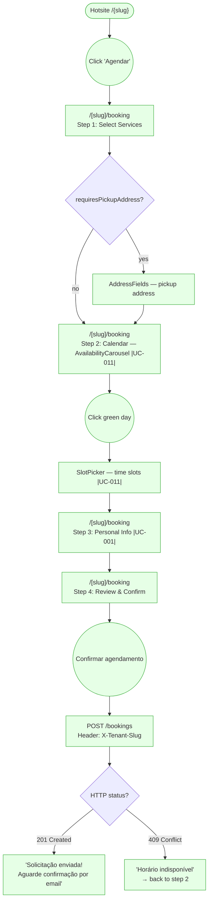

# GUEST — Book a Service

**Actor(s):** GUEST  
**Goal:** Submit a booking request on a tenant's public hotsite without authentication  
**UCs covered:** UC-001, UC-011  
**Status:** Reviewed

## Flow

## Pages referenced

| Page / Route | Component | Story | Status |
|---|---|---|---|
| `/[slug]/booking` | `BookingForm` (orchestrates steps) | M12-S07 | ✅ Existing |
| Step 1 | `ServiceSelectionStep` + `AddressFields` | M12-S07 | ✅ Existing |
| Step 2 | `AvailabilityCarousel` + `SlotPicker` | M12-S07 | ✅ Existing |
| Step 3 | `PersonalInfoStep` + `PhotoUpload` | M12-S07 | ✅ Existing |
| Step 4 | `ConfirmationStep` | M12-S07 | ✅ Existing |

## Open questions / gaps

- No open gaps for the guest booking path — fully built as of M12-S07.
- UC-005 (A2) — guest submits admin-requested info: backend complete (`PATCH /bookings/:id/submit-info/guest?token=`), but frontend page `/[slug]/bookings/:id/submit-info` does not exist. Tracked in `guest/use-cases.md`. Out of scope for this journey.
