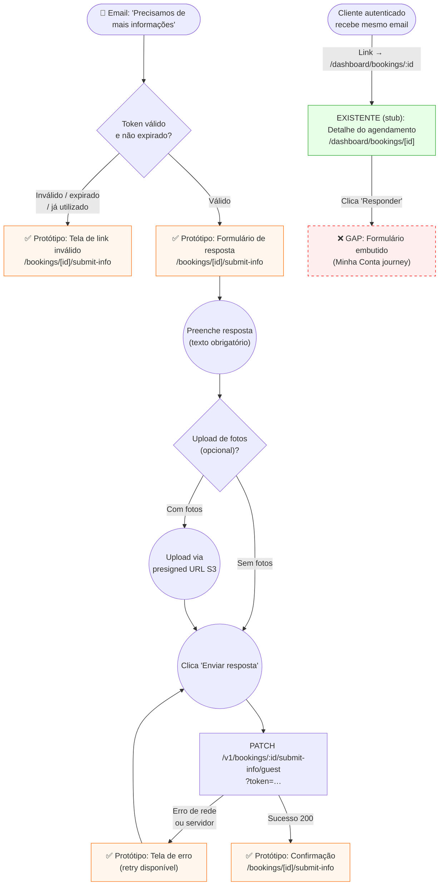

# GUEST — Responder à Solicitação de Informação

**Actor(s):** GUEST (main path — unauthenticated, email link); CUSTOMER (alt path — authenticated, via minha-conta)
**Goal:** Submit the additional information requested by the admin so the booking returns to PENDING and can be approved.
**UCs covered:** UC-005 A2
**Status:** Reviewed — fully specced as `M13-S38`/`M13-S39`/`M13-S40` in `plan/M13-DASHBOARD-FRONTEND.md` (implementable, not yet built)

## Flow



**Legend:** `existing` (green) = code already in production. `prototyped` (orange) = UX validated via static HTML prototype in `prototypes/submit-info/`, but no implementation story written yet. `gap` (red, dashed) = no design or prototype exists yet — genuinely undesigned.

## Pages referenced

| Page / Route | Component | Story | Status |
|---|---|---|---|
| `apps/web/app/bookings/[id]/submit-info/page.tsx` | `SubmitInfoPage` | TBD | ❌ GAP |

**Note on routing:** `bookings/` is a static Next.js segment and takes priority over the `[slug]/` dynamic segment — no conflict. The page lives outside both the hotsite (`[slug]/`) and the dashboard (`dashboard/`).

**Note on authenticated path:** The customer's email links to `/dashboard/bookings/:id` (existing stub). The submission form for authenticated customers will be embedded in `BookingDetailPage` (Minha Conta journey — tracked separately as IA gap #2).

## Implementation prerequisites

Before building this page, update `buildRespondLink()` in:
```
apps/backend/src/contexts/notification/application/use-cases/
  send-booking-info-requested-notification/
    send-booking-info-requested-notification.use-case.ts
```
Change line ~84:
```ts
// Before:
return `${frontendUrl}/bookings/${dto.bookingId}/responder?token=${token}`;
// After:
return `${frontendUrl}/bookings/${dto.bookingId}/submit-info?token=${token}`;
```
Also update the companion `.spec.ts` to expect the new path. This is a backend code change — belongs in the same story that creates the frontend page.

## Open questions / gaps

- [ ] Tenant branding on this page — see canonical description in `prototypes/submit-info/dev-notes.md` § Known limitations ("No branding per tenant").
- [ ] Photo upload: presigned URL endpoint needed for unauthenticated context — does `POST /v1/bookings/:id/presigned-url/guest?token=` exist, or does the guest just submit text and a staff member uploads photos later?
- [x] What should the page say if the booking has already been approved/rejected before the guest submits info (booking status is no longer `INFO_REQUESTED`)? — **Resolved.** The API returns `409`/non-`INFO_REQUESTED`; `M13-S40`'s invalid-link view gets a `reason="processed"` variant with copy "este agendamento já foi processado."
- [ ] Does the "Criar conta / Entrar" link on the success screen (`02-success.html`) generate real value for the guest at that moment, or is it noise that distracts from the confirmation message? (raised in `prototypes/submit-info/index.html` dry-run checklist item 5)
