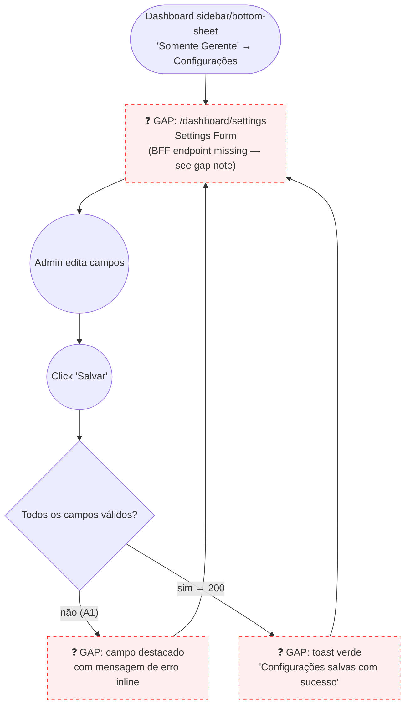

# MANAGER — Configurações (Tenant Settings)

**Actor(s):** MANAGER
**Goal:** Configure tenant-wide operational settings — business hours, timezone, cancellation window, loyalty point expiry, booking buffer, and business contact info — that govern booking and loyalty behavior across the tenant
**UCs covered:** UC-026
**Status:** Draft

## Flow

## Pages referenced

| Page / Route | Component | Story | Status |
|---|---|---|---|
| `/dashboard/settings` | `TenantSettingsForm` | TBD | 📋 Gap |

## Open questions / gaps

- [ ] **🔴 Blocking — BFF endpoint missing.** Backend `PATCH /tenants/settings` is fully implemented, `MANAGER`-guarded, and `.http`-covered (`apps/backend/src/contexts/platform/infrastructure/controllers/tenant-settings.controller.ts`) — but no BFF controller exposes it (confirmed via `/uc-audit UC-026,UC-027,UC-028,UC-029`, 2026-06-16). Unlike Equipe and Hotsite, this journey needs a **new BFF story** (proxy route in the `platform` BFF module) before any frontend story can follow.
- [ ] **Two data sources, one form** — UC-026 step 1 describes loading "current `tenants.settings` JSONB," but `Nome do estabelecimento` and `Slug` are actually `tenants` table columns, not JSONB fields (UC step 5 confirms the save updates both `tenants.settings` *and* `tenants.name`). The prototype's single combined form needs to make this invisible to the admin — confirm section grouping (e.g. "Geral" / "Agendamento" / "Fidelidade" / "Contato") so the data-source split doesn't leak into the UI.
- [ ] **Business hours editor UX** — per-day open/close time pickers, plus a way to mark a day fully closed. Cross-check exact shape against `docs/21-TENANTS_SETTINGS_SCHEMA.md` before designing the form.
- [ ] **Audit log surface** — UC-026 step 6 says the system logs "who changed what and when," but CLAUDE.md §6 lists "audit log view" as an explicitly missing/undocumented UC. Treat as out of scope for this journey's prototype (no "Histórico de alterações" panel) unless the user says otherwise — don't invent a screen for an undocumented capability.
- [ ] **Timezone field** — dropdown over the full IANA list, or read-only/fixed display for MVP given CLAUDE.md's "one timezone per tenant, default `America/Sao_Paulo`"? Single-location tenants may never need to change it.

## Prototype

Folder: `manager/prototypes/configuracoes/`

| File | Screen | UC | Status |
|---|---|---|---|
| `index.html` | Navigation hub + dry-run checklist (flags the missing BFF endpoint) | — | ✅ Criado |
| `01-settings-form.html` | Settings form (Geral / Agendamento / Fidelidade / Horário / Contato) | UC-026 | ✅ Criado |
| `01b-validation-error.html` | Invalid field value error | UC-026 A1 | ✅ Criado |
| `01c-saved-success.html` | Save confirmation | UC-026 | ✅ Criado |
| `dev-notes.md` | Implementation handoff (BFF gap detailed) | — | ✅ Criado |
