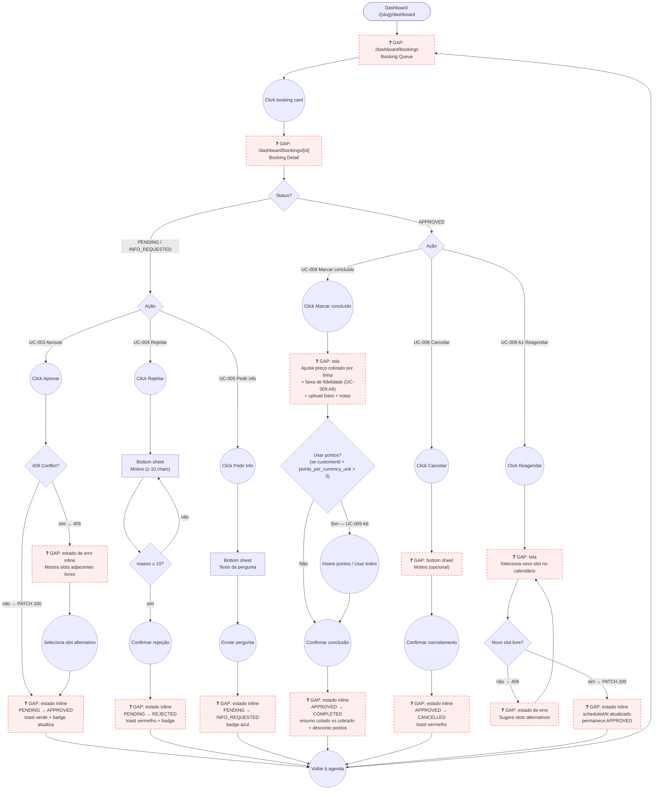

# STAFF — Agenda (Booking Queue & Lifecycle Management)

**Actor(s):** STAFF | MANAGER  
**Goal:** Review the daily booking queue, action each request — approve, reject, or request more information — and manage an approved booking through to completion, cancellation, or reschedule  
**UCs covered:** UC-003, UC-004, UC-005, UC-008, UC-009 (incl. A6 — loyalty redemption during completion)  
**Status:** Draft

## Flow

## Pages referenced

| Page / Route | Component | Story | Status |
|---|---|---|---|
| `/dashboard/bookings` | `BookingQueuePage` | M125-S03 | 📋 Planejado |
| `/dashboard/bookings/[id]` | `BookingDetailPage` + `BookingActionPanel` | M125-S05 | 📋 Planejado |
| Slot conflict inline state | `SlotConflictAlert` within `BookingActionPanel` | M125-S05 | 📋 Planejado |
| Approve success inline state | `BookingApprovedBanner` within `BookingDetailPage` | M125-S05 | 📋 Planejado |
| Reject bottom sheet | `RejectBookingSheet` within `BookingDetailPage` | M125-S05 | 📋 Planejado |
| Request info bottom sheet | `RequestInfoSheet` within `BookingDetailPage` | M125-S05 | 📋 Planejado |
| Mark-complete sheet | `MarkCompleteSheet` (per-line `actualPriceCharged` override + loyalty redemption strip UC-009 A6 + after-photo upload + notes) within `BookingDetailPage` | — (not yet scoped) | ❓ GAP |
| Complete success inline state | `BookingCompletedBanner` within `BookingDetailPage` (shows per-line cotado vs cobrado + optional loyalty discount row) | — (not yet scoped) | ❓ GAP |
| Admin cancel bottom sheet | `AdminCancelBookingSheet` within `BookingDetailPage` | — (not yet scoped) | ❓ GAP |
| Reschedule calendar screen | `RescheduleBookingCalendar` within `BookingDetailPage` (reuses UC-011 availability calendar) | — (not yet scoped) | ❓ GAP |
| Reschedule slot-conflict state | `RescheduleConflictAlert` within `RescheduleBookingCalendar` | — (not yet scoped) | ❓ GAP |

## Open questions / gaps

- [x] **Success state UX** — **Resolved.** The admin stays on the detail page after approval; production renders the inline success banner in place (no navigation). The prototype shows `02-approve-success.html` as a separate page only for review clarity — see its `STATE`/`PROTOTYPE` HTML comment, which states "same page, no navigation" explicitly. The aside panel's only action is "Voltar à agenda", a manual back-link, not an auto-redirect.
- [x] **Reject/info success** — **Resolved.** Same pattern as approval: after REJECTED or INFO_REQUESTED, the admin stays on the detail page with an inline banner (`01c-reject-success.html`, `01d-info-success.html`) and a manual "Voltar à agenda" link — no auto-navigate. The same pattern is also used for cancel (`03b-cancel-success.html`), complete (`04b-complete-success.html`), and reschedule (`05c-reschedule-success.html`), confirming this is the system-wide convention for every booking-lifecycle action, not just approve.
- [x] **Queue scope** — **Resolved 2026-06-16.** Grouped by urgency, not by date: "Precisa de ação" (ALL PENDING + INFO_REQUESTED, any date, sorted by `scheduledAt`) → "Hoje" (today's APPROVED, actionable) → "Próximos dias" (future APPROVED, read-only glance, no quick actions). The previous date-first grouping split same-kind triage work across day sections (a PENDING booking for tomorrow was separated from today's PENDING items). Decorative filter tabs (Pendentes/Info solicitada/Confirmados/Todos) were removed — the sections themselves are the filter now.
- [ ] **Queue real-time updates** — polling interval or WebSocket? Two staff members might be viewing the same booking simultaneously.
- [ ] **Slot conflict suggestion count** — prototype shows 3 adjacent free slots. Is 3 the right number? What if all remaining slots in the day are taken?
- [ ] **Notification on approve** — `BookingApproved` event triggers email to customer. Confirm the "email enviado" note in the success banner is accurate for the MVP notification flow.
- [ ] **INFO_REQUESTED → PENDING re-entry** — UC-005 Alt flow A2 (customer submits info) is handled in `customer/` and `guest/` journeys. Confirm: does the booking return to the PENDING queue automatically when the customer responds, or must staff re-find it manually?
- [x] **Queue surfacing of APPROVED bookings** — **Resolved 2026-06-16** by the "Hoje" and "Próximos dias" sections above — see `00-agenda.html`.
- [ ] **Week-strip click target for future days** — clicking any future day-pill jumps to the single "Próximos dias" section (not split per-day), so a future PENDING booking (which lives in "Precisa de ação" instead) won't actually be visible at that anchor. This is a known approximation in the prototype — decide whether production needs real per-day filtering/highlighting or whether this is acceptable.
- [ ] **Mark-complete UX** — per-line `actualPriceCharged` override: inline editable fields next to each line (as shown in UC-009's doc example), or a separate "review charges" step before confirming? Photo upload — does it reuse the same upload component as the guest/customer "before" photos (UC-001 step 8)?
- [ ] **Reschedule calendar reuse** — does `RescheduleBookingCalendar` reuse the exact `AvailabilityCalendar` component from the guest/customer booking flow (UC-011), or does staff need a simplified version (e.g. no basket/duration recompute, since services are frozen at APPROVED)?
- [ ] **Admin cancel reason validation** — backend `CancelBookingAsAdminBody.reason` is optional with no minimum length (unlike UC-004 Reject's required ≥10 chars). Confirm the bottom sheet should make it genuinely optional, or whether a minimum length should be added for consistency with Reject.
- [ ] **Cancel vs. Reschedule entry point** — does the Detail page show both "Cancelar" and "Reagendar" as equally-weighted buttons, or is one primary and the other a secondary/menu action (to avoid accidental cancellation of a confirmed booking)?

## Prototype

Folder: `staff/prototypes/agenda/`

| File | Screen | UC | Story | Status |
|---|---|---|---|---|
| `index.html` | Navigation hub + validation checklist | — | — | ✅ Criado |
| `00-agenda.html` | Booking queue (today's PENDING + INFO_REQUESTED) | — | M125-S03 | ✅ Criado |
| `01-booking-detail.html` | Booking detail + inline Reject/Info bottom sheets | UC-003, UC-004, UC-005 | M125-S05 | ✅ Criado |
| `01b-slot-conflict.html` | Slot conflict error + adjacent slot picker | UC-003 Alt A1 | M125-S05 | ✅ Criado |
| `01c-reject-success.html` | Reject success inline state (actionState = 'rejected') | UC-004 | M125-S05 | ✅ Criado |
| `01d-info-success.html` | Info-request success inline state (actionState = 'info-requested') | UC-005 | M125-S05 | ✅ Criado |
| `02-approve-success.html` | Approval success (prototype page; production = inline) | UC-003 | M125-S05 | ✅ Criado |
