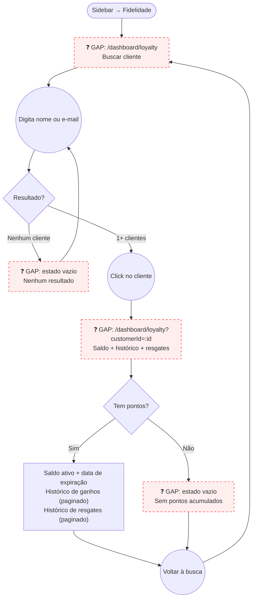

# STAFF — Fidelidade (Customer Loyalty Lookup)

**Actor(s):** STAFF | MANAGER
**Goal:** Look up any customer's active loyalty balance, earning history, and redemption history from the dashboard
**UCs covered:** UC-016 (admin/staff variant)
**Status:** Draft

## Flow

## Pages referenced

| Page / Route | Component | Story | Status |
|---|---|---|---|
| `/dashboard/loyalty` | `LoyaltySearchPage` | — | ❓ GAP |
| `/dashboard/loyalty?customerId=:id` | `CustomerLoyaltyPage` | — | ❓ GAP |
| Estado vazio — sem resultados | inline em `LoyaltySearchPage` | — | ❓ GAP |
| Estado vazio — sem pontos | inline em `CustomerLoyaltyPage` | — | ❓ GAP |

## Open questions / gaps

- [ ] **Ponto de entrada alternativo:** staff pode chegar à tela de fidelidade do cliente a partir do detalhe do agendamento (UC-003 já mostra o saldo no detalhe) — deve haver um link "Ver histórico completo" no card de fidelidade do booking detail?
- [ ] **Paginação:** `GET /v1/customers/:customerId/loyalty/entries` e `/redemptions` retornam paginado. Quantos itens por página? Scroll infinito ou "carregar mais"?
- [ ] **Resgate manual sem booking:** a tela de busca mostrará um botão "Registrar resgate" desvinculado de agendamento? Decisão de produto — para MVP, resgates são apenas via UC-009 (conclusão de agendamento). Se sim, precisaria de um novo fluxo.
- [ ] **Busca por telefone:** incluir busca por número de telefone além de nome/email?
