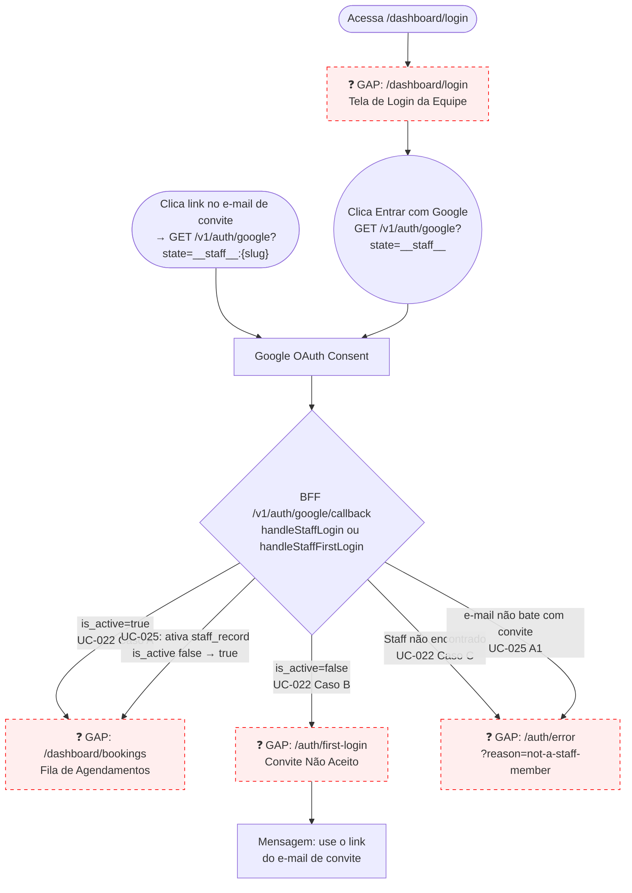

# STAFF — Login (UC-022 + UC-025)

**Actor(s):** STAFF | MANAGER  
**Goal:** Staff member authenticates with Google OAuth and lands on the dashboard booking queue; invited staff activate their account on first access  
**UCs covered:** UC-022, UC-025  
**Status:** Draft

## Flow

## Pages referenced

| Page / Route | Component | Story | Status |
|---|---|---|---|
| `/dashboard/login` | `StaffLoginPage` | M124-S01 | ❌ GAP |
| `/auth/first-login` | `FirstLoginPage` | M124-S01 | ❌ GAP |
| `/auth/error` | `AuthErrorPage` | M124-S01 | ❌ GAP |
| `/dashboard/bookings` | `BookingQueuePage` | M125-S03 | ❌ GAP (planned) |

## BFF calls in this flow

| Call | When |
|---|---|
| `GET /v1/auth/google?state=__staff__` | Staff clicks "Entrar com Google" on `/dashboard/login` |
| `GET /v1/auth/google?state=__staff__:{tenantSlug}` | Staff clicks invite email link (UC-025) |
| `GET /internal/staff/by-oauth?googleOAuthId=...` | BFF callback — regular login lookup |
| `GET /internal/staff/by-email?email=...&tenantId=...` | BFF callback — first-login invite lookup |
| `POST /internal/staff/:staffId/activate` | BFF callback — UC-025 activation |

## Open questions / gaps

- [ ] **Route for staff login:** prototype uses `/dashboard/login`; M125-S01 references `/{tenantSlug}/staff-login`. Which is canonical? `/dashboard/login` is simpler (staff is single-tenant; no slug needed). Decide before M124-S01.
- [ ] **"Bem-vindo(a)!" banner on first login (UC-025 step 8):** does the dashboard show a one-time welcome message after first activation? If yes, it belongs in M124-S01 as an inline success state on the dashboard, not a separate page.
- [ ] **Deactivated staff (UC-025 A3 / A2):** tenant deactivated after invite sent — should `/auth/error` show a distinct message? The BFF must handle this case and pass `?reason=tenant-deactivated`.
- [ ] **JWT expiry / re-login:** no logout or refresh endpoint exists yet. Staff whose JWT expires will be redirected to `/dashboard/login`. Confirm this is the intended re-login flow.

## Prototype

Folder: `staff/prototypes/login/`

| File | Screen | UC | Story | Status |
|---|---|---|---|---|
| `index.html` | Navigation hub | — | — | ✅ Criado |
| `00-staff-login.html` | Login page (redirect → shared/staff-login.html) | UC-022, UC-025 | M124-S01 | ✅ Criado |
| `01-first-login.html` | Invite not accepted — "use the invite email link" | UC-022 Caso B | M124-S01 | ✅ Criado |
| `01b-error.html` | Auth error page (not found / email mismatch) | UC-022 Caso C, UC-025 A1 | M124-S01 | ✅ Criado |
| `dev-notes.md` | Implementation handoff | — | M124-S01 | ✅ Criado |
